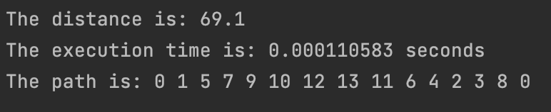

# Algorithm Design

## Routing Algorithm

This project focuses on analyzing the Travelling Salesperson Problem (TSP) and designing both exact algorithms and heuristic approaches to solve it, enabling comparison between their performance and practicality in different contexts. The problem is addressed using diverse datasets, including those from ocean shipping and urban delivery contexts.

Implemented Algorithms:
* **Backtracking:** An exact algorithm that explores all possible routes to find the optimal solution.
* **Triangular Approximation Heuristic:** A heuristic approach based on the triangle inequality to reduce the search space and improve efficiency.
* **Christofides Approximation:** A well-known approximation algorithm that guarantees a solution within 1.5 times the optimal.
* **Custom Heuristic Approximation:** A developed heuristic designed to balance computational efficiency with solution accuracy, tailored for specific dataset characteristics.

## Implemented Features

> ### Setting Graphs

> ### Main Menu

> ### Backtracking Option

> ### Triangular Approximation Heuristic Option

> ### Other Heuristics Option

